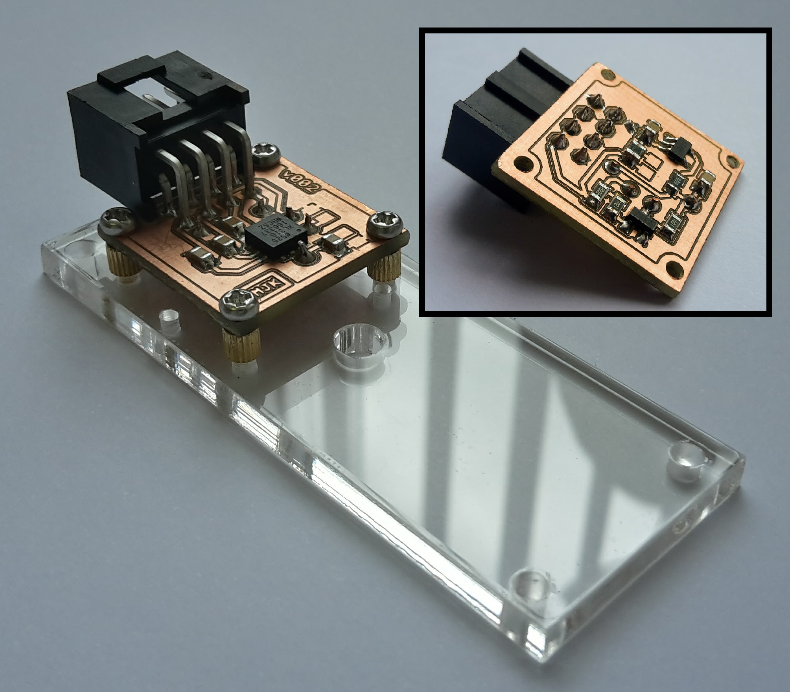

# ADXL316 module
Part of:
**Energy Harvesting Measurement Rig (ENHAMER)**

*A System for Characterisation of Piezoelectric Materials and Associated Electronics for Vibration Powered Energy Harvesting Devices*

Assembled module mounted on acrylic holder:

SOURCE: https://github.com/enhamer

Credits: NEMESIS- Novel Energy Materials, Engineering Science and Integrated Systems